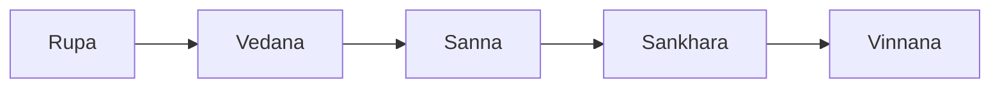
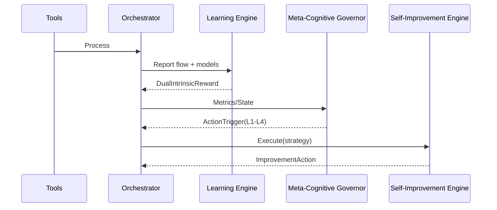

# Pandora Genesis SDK — Architecture Overview

## High-level Components

- `pandora_core`: Ontology and traits (FEPCell, Skandhas, WorldModel)
- `pandora_tools`: Skills and agents
- `pandora_orchestrator`: Skill orchestration, circuit breaker
- `pandora_cwm`: Causal World Model (VSA/NN/TDA)
- `pandora_learning_engine`: Rewards and learning loop
- `pandora_mcg`: Meta-Cognitive Governor
- `pandora_sie`: Self-Improvement Engine

## Cognitive Pipeline (Skandhas)

## Self-Improvement Loop

## Observability

- Tracing spans on critical paths (SIE/MCG)
- Optional Prometheus exporter (example `monitoring`): `:9000/metrics`

## Build Profiles & Features

- `pandora_cwm/ml`: ML stack
- `pandora_mcg/metrics_instrumentation`, `pandora_sie/metrics_instrumentation`
- `pandora_orchestrator/prometheus_export` (example only)

